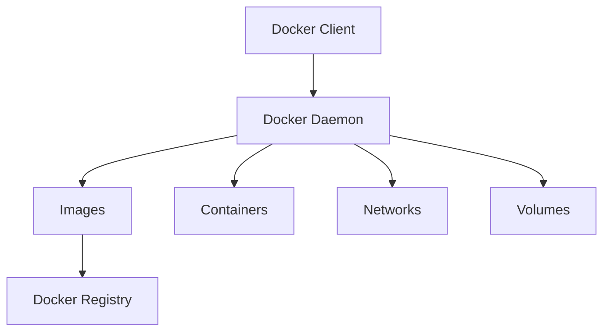

## ¿Qué es Docker y por qué revolucionó el desarrollo?

Docker es una **plataforma de contenedorización** que permite empaquetar aplicaciones junto con todas sus dependencias en contenedores ligeros y portables. Esta tecnología ha revolucionado la manera en que desarrollamos, distribuimos y ejecutamos aplicaciones.

Un **contenedor** es fundamentalmente diferente a una máquina virtual tradicional. Mientras que las VMs virtualizan hardware completo, los contenedores comparten el kernel del sistema operativo host, haciendo que sean:

- **Extremadamente ligeros** (MBs vs GBs)
- **Arranque instantáneo** (segundos vs minutos)  
- **Altamente portables** (mismo comportamiento en dev, test y producción)
- **Eficientes en recursos** (mayor densidad por servidor)

### Arquitectura de Docker



**Componentes principales:**
- **Docker Engine**: daemon que gestiona contenedores
- **Docker Images**: plantillas inmutables para crear contenedores  
- **Docker Containers**: instancias ejecutables de las imágenes
- **Docker Registry**: repositorio de imágenes (Docker Hub, AWS ECR, etc.)
- **Dockerfile**: receta para construir imágenes

## Casos de uso profesionales

### 1. **Microservicios Architecture**
Docker facilita la implementación de arquitecturas de microservicios, donde cada servicio corre en su propio contenedor:

```yaml
# docker-compose.yml para microservicios
version: '3.8'
services:
  api-gateway:
    image: nginx:alpine
    ports: ["80:80"]
  
  user-service:
    build: ./services/users
    environment:
      - DB_HOST=user-db
  
  order-service:
    build: ./services/orders
    depends_on: [user-service]
```

### 2. **CI/CD Pipelines**
Ambientes consistentes desde desarrollo hasta producción:

```yaml
# .gitlab-ci.yml
stages:
  - test
  - build
  - deploy

test:
  image: node:16-alpine
  script:
    - npm test
    
build:
  script:
    - docker build -t $CI_REGISTRY_IMAGE:$CI_COMMIT_SHA .
    - docker push $CI_REGISTRY_IMAGE:$CI_COMMIT_SHA
```

### 3. **Development Environment Standardization**
Elimina el problema "funciona en mi máquina":

```bash
# Un comando para setup completo del entorno
docker-compose up -d
```

## Docker vs Máquinas Virtuales: Comparación Técnica

| Aspecto | Docker Containers | Virtual Machines |
|---------|------------------|-------------------|
| **Boot Time** | < 1 segundo | 30-60 segundos |
| **Memory Overhead** | ~2-8MB | 512MB - 2GB+ |
| **Isolation Level** | Process-level | Hardware-level |
| **OS Support** | Shared kernel | Multiple OS |
| **Performance** | Near-native | 5-10% overhead |
| **Storage Efficiency** | Layered filesystem | Full OS images |
| **Density** | 100s per host | 10s per host |

### ¿Cuándo usar cada uno?

**Usa Docker cuando:**
- Desarrolles aplicaciones cloud-native
- Necesites deployment rápido y escalable
- Implementes microservicios
- Requieras CI/CD eficiente

**Usa VMs cuando:**
- Necesites aislamiento completo de seguridad
- Ejecutes diferentes sistemas operativos
- Tengas aplicaciones legacy monolíticas
- Requieras compliance estricto

## Conceptos fundamentales

### **Imagen (Image)**
Plantilla de solo lectura que contiene:
- Sistema de archivos
- Dependencias y librerías  
- Configuración de runtime
- Metadatos

```bash
# Anatomía de una imagen
docker image inspect nginx:alpine
```

### **Contenedor (Container)**
Instancia ejecutable de una imagen con:
- Capa de escritura encima de la imagen
- Proceso(s) en ejecución
- Configuración de red y storage
- Estado mutable

### **Dockerfile**
Archivo de texto con instrucciones para construir imágenes:

```dockerfile
# Ejemplo de Dockerfile multi-stage
FROM node:16-alpine AS builder
WORKDIR /app
COPY package*.json ./
RUN npm ci --only=production

FROM node:16-alpine AS runtime
RUN addgroup -g 1001 -S nodejs && \
    adduser -S nextjs -u 1001
WORKDIR /app
COPY --from=builder --chown=nextjs:nodejs /app/node_modules ./node_modules
COPY --chown=nextjs:nodejs . .
USER nextjs
EXPOSE 3000
CMD ["npm", "start"]
```

### **Volumes**
Mecanismo de persistencia que permite:
- Compartir datos entre contenedores
- Persistir datos después de que el contenedor se elimine
- Montar directorios del host

### **Networks**
Sistema de comunicación entre contenedores:
- **Bridge**: red por defecto, aislada del host
- **Host**: usa la red del host directamente
- **Overlay**: comunicación entre hosts en Docker Swarm
- **Custom**: redes definidas por usuario

## Instalación profesional en Debian 12

### Método recomendado (Docker Official Repository)

```bash
# 1. Remover versiones previas
sudo apt remove docker docker-engine docker.io containerd runc

# 2. Configurar el repositorio oficial
sudo apt update
sudo apt install -y ca-certificates curl gnupg lsb-release

# 3. Agregar clave GPG oficial de Docker
sudo mkdir -m 0755 -p /etc/apt/keyrings
curl -fsSL https://download.docker.com/linux/debian/gpg | sudo gpg --dearmor -o /etc/apt/keyrings/docker.gpg

# 4. Configurar repositorio estable
echo \
  "deb [arch=$(dpkg --print-architecture) signed-by=/etc/apt/keyrings/docker.gpg] https://download.docker.com/linux/debian \
  $(lsb_release -cs) stable" | sudo tee /etc/apt/sources.list.d/docker.list > /dev/null

# 5. Instalar Docker Engine + Compose
sudo apt update
sudo apt install -y docker-ce docker-ce-cli containerd.io docker-buildx-plugin docker-compose-plugin

# 6. Agregar usuario actual al grupo docker (evita sudo)
sudo usermod -aG docker $USER
newgrp docker

# 7. Verificar instalación
docker run hello-world
docker compose version
```

### Post-instalación: Configuración de seguridad

```bash
# Configurar Docker daemon para mayor seguridad
sudo mkdir -p /etc/docker
sudo tee /etc/docker/daemon.json > /dev/null <<EOF
{
  "log-driver": "json-file",
  "log-opts": {
    "max-size": "10m",
    "max-file": "3"
  },
  "storage-driver": "overlay2",
  "userland-proxy": false,
  "no-new-privileges": true
}
EOF

# Reiniciar servicio
sudo systemctl restart docker
sudo systemctl enable docker
```

## Comandos esenciales para profesionales

### Gestión de imágenes

```bash
# Buscar imágenes en Docker Hub
docker search nginx

# Descargar imagen específica con tag
docker pull nginx:1.25-alpine

# Listar imágenes locales con detalles
docker images --format "table {{.Repository}}\t{{.Tag}}\t{{.Size}}\t{{.CreatedAt}}"

# Inspeccionar imagen (layers, configuración, etc.)
docker image inspect nginx:alpine --format '{{json .Config.Env}}'

# Historial de layers
docker image history nginx:alpine

# Limpiar imágenes no utilizadas
docker image prune -a
```

### Gestión de contenedores

```bash
# Ejecutar contenedor con opciones avanzadas
docker run -d \
  --name web-server \
  --restart unless-stopped \
  --memory="512m" \
  --cpus="0.5" \
  -p 8080:80 \
  -v /host/data:/usr/share/nginx/html:ro \
  --health-cmd="curl -f http://localhost/ || exit 1" \
  --health-interval=30s \
  nginx:alpine

# Monitoreo en tiempo real
docker stats --format "table {{.Container}}\t{{.CPUPerc}}\t{{.MemUsage}}\t{{.NetIO}}"

# Logs con seguimiento
docker logs -f --tail 50 web-server

# Ejecutar comandos dentro del contenedor
docker exec -it web-server sh

# Copiar archivos host ↔ contenedor
docker cp ./index.html web-server:/usr/share/nginx/html/

# Exportar/importar contenedores
docker export web-server | gzip > backup.tar.gz
zcat backup.tar.gz | docker import - my-backup:latest
```

### Gestión de redes

```bash
# Crear red personalizada
docker network create --driver bridge \
  --subnet=172.20.0.0/16 \
  --ip-range=172.20.240.0/20 \
  my-network

# Conectar contenedor a red
docker network connect my-network web-server

# Inspeccionar red
docker network inspect my-network
```

### Gestión de volúmenes

```bash
# Crear volumen nombrado
docker volume create --driver local \
  --opt type=none \
  --opt o=bind \
  --opt device=/host/path \
  my-volume

# Respaldar volumen
docker run --rm -v my-volume:/backup-vol -v $(pwd):/backup alpine \
  tar czf /backup/backup.tar.gz -C /backup-vol .

# Restaurar volumen
docker run --rm -v my-volume:/restore-vol -v $(pwd):/backup alpine \
  tar xzf /backup/backup.tar.gz -C /restore-vol
```

## Dockerfile: Construyendo imágenes profesionales

### Ejemplo básico optimizado

```dockerfile
# Multi-stage build para aplicación Node.js
FROM node:18-alpine AS dependencies
WORKDIR /app
COPY package*.json ./
RUN npm ci --only=production && npm cache clean --force

FROM node:18-alpine AS build
WORKDIR /app
COPY package*.json ./
RUN npm ci
COPY . .
RUN npm run build

FROM node:18-alpine AS runtime
# Crear usuario no-root por seguridad
RUN addgroup -g 1001 -S nodejs && \
    adduser -S nextjs -u 1001

WORKDIR /app

# Copiar solo lo necesario
COPY --from=dependencies --chown=nextjs:nodejs /app/node_modules ./node_modules
COPY --from=build --chown=nextjs:nodejs /app/dist ./dist

# Cambiar a usuario no-root
USER nextjs

# Exponer puerto
EXPOSE 3000

# Health check
HEALTHCHECK --interval=30s --timeout=3s --start-period=5s --retries=3 \
  CMD curl -f http://localhost:3000/health || exit 1

# Comando de inicio
CMD ["node", "dist/server.js"]
```

### Mejores prácticas para Dockerfiles

```dockerfile
# ✅ BUENAS PRÁCTICAS
FROM nginx:alpine
LABEL maintainer="andres@t4ifi.dev" \
      version="1.0" \
      description="Web server optimizado"

# Usar cache de layers eficientemente
RUN apk update && \
    apk add --no-cache curl && \
    rm -rf /var/cache/apk/*

# Copiar archivos específicos primero (mejor cache)
COPY requirements.txt /app/
RUN pip install -r requirements.txt

# Copiar código al final
COPY . /app/

# Usuario no-root
RUN adduser -D appuser
USER appuser

# Configuraciones seguras
ENV NODE_ENV=production
EXPOSE 8080
VOLUME ["/app/data"]
```

### Construcción optimizada

```bash
# Build con optimizaciones
docker build \
  --build-arg NODE_ENV=production \
  --target runtime \
  --tag myapp:v1.0 \
  --file Dockerfile.prod \
  .

# Build con BuildKit (más rápido)
DOCKER_BUILDKIT=1 docker build --tag myapp:v1.0 .

# Build multi-plataforma
docker buildx build \
  --platform linux/amd64,linux/arm64 \
  --tag myapp:v1.0 \
  --push .
```

## Docker Compose: Orquestación de aplicaciones

### Anatomía de docker-compose.yml

```yaml
version: '3.8'

services:
  # Servicio web con configuración avanzada
  web:
    build: 
      context: .
      dockerfile: Dockerfile.prod
      args:
        - NODE_ENV=production
    ports:
      - "80:8080"
    environment:
      - DATABASE_URL=postgresql://user:pass@db:5432/myapp
      - REDIS_URL=redis://cache:6379
    volumes:
      - ./uploads:/app/uploads
      - logs:/app/logs
    depends_on:
      db:
        condition: service_healthy
      cache:
        condition: service_started
    networks:
      - frontend
      - backend
    restart: unless-stopped
    deploy:
      resources:
        limits:
          memory: 512M
          cpus: '0.5'
    healthcheck:
      test: ["CMD", "curl", "-f", "http://localhost:8080/health"]
      interval: 30s
      timeout: 10s
      retries: 3

  # Base de datos PostgreSQL
  db:
    image: postgres:15-alpine
    environment:
      POSTGRES_DB: myapp
      POSTGRES_USER: user
      POSTGRES_PASSWORD_FILE: /run/secrets/db_password
    volumes:
      - postgres_data:/var/lib/postgresql/data
      - ./init.sql:/docker-entrypoint-initdb.d/init.sql:ro
    networks:
      - backend
    secrets:
      - db_password
    healthcheck:
      test: ["CMD-SHELL", "pg_isready -U user -d myapp"]
      interval: 10s
      timeout: 5s
      retries: 5

  # Cache Redis
  cache:
    image: redis:7-alpine
    command: redis-server --appendonly yes --requirepass ${REDIS_PASSWORD}
    volumes:
      - redis_data:/data
    networks:
      - backend
    sysctls:
      - net.core.somaxconn=65535

  # Reverse proxy
  nginx:
    image: nginx:alpine
    ports:
      - "443:443"
      - "80:80"
    volumes:
      - ./nginx.conf:/etc/nginx/nginx.conf:ro
      - ./ssl:/etc/nginx/ssl:ro
    depends_on:
      - web
    networks:
      - frontend

# Definición de volúmenes
volumes:
  postgres_data:
    driver: local
  redis_data:
    driver: local
  logs:
    driver: local

# Definición de redes
networks:
  frontend:
    driver: bridge
  backend:
    driver: bridge
    internal: true

# Secrets para información sensible
secrets:
  db_password:
    file: ./secrets/db_password.txt
```

### Comandos avanzados de Compose

```bash
# Levantar en background con logs
docker compose up -d && docker compose logs -f

# Escalar servicios específicos
docker compose up --scale web=3 --scale worker=2

# Ejecutar comandos en servicios
docker compose exec web bash
docker compose run --rm web npm test

# Ver uso de recursos
docker compose top

# Aplicar cambios sin downtime
docker compose up -d --no-deps web

# Backup completo del stack
docker compose down
docker run --rm -v $(pwd):/backup \
  -v myapp_postgres_data:/data alpine \
  tar czf /backup/postgres-backup.tar.gz -C /data .

# Restore
docker volume create myapp_postgres_data
docker run --rm -v $(pwd):/backup \
  -v myapp_postgres_data:/data alpine \
  tar xzf /backup/postgres-backup.tar.gz -C /data
```

### Configuración de entornos

```bash
# .env para desarrollo
echo "
POSTGRES_PASSWORD=devpass123
REDIS_PASSWORD=redisdev123
NODE_ENV=development
DEBUG=true
" > .env

# .env.prod para producción
echo "
POSTGRES_PASSWORD=secure_prod_pass
REDIS_PASSWORD=secure_redis_pass
NODE_ENV=production
DEBUG=false
" > .env.prod

# Usar archivo específico
docker compose --env-file .env.prod up -d
```

## Seguridad en Docker: Mejores prácticas

### Seguridad del host

```bash
# Configurar AppArmor/SELinux para contenedores
sudo aa-status | grep docker

# Configurar límites del sistema
echo "
# /etc/security/limits.conf
* soft nofile 65536
* hard nofile 65536
* soft nproc 32768
* hard nproc 32768
" | sudo tee -a /etc/security/limits.conf
```

### Hardening de contenedores

```dockerfile
# Dockerfile seguro
FROM node:18-alpine

# Crear usuario no-root
RUN addgroup -g 1001 -S appgroup && \
    adduser -S appuser -u 1001 -G appgroup

# Instalar solo lo necesario
RUN apk add --no-cache dumb-init && \
    rm -rf /var/cache/apk/*

# Configurar directorio de trabajo
WORKDIR /app
RUN chown -R appuser:appgroup /app

# Copiar archivos con permisos correctos
COPY --chown=appuser:appgroup package*.json ./
USER appuser
RUN npm ci --only=production

COPY --chown=appuser:appgroup . .

# Configuraciones de seguridad
ENV NODE_ENV=production
EXPOSE 3000

# Usar dumb-init para manejar señales correctamente
ENTRYPOINT ["dumb-init", "--"]
CMD ["node", "server.js"]
```

### Escaneo de vulnerabilidades

```bash
# Escanear imagen con Trivy
docker run --rm -v /var/run/docker.sock:/var/run/docker.sock \
  aquasec/trivy image nginx:latest

# Escanear con Docker Scout
docker scout cves nginx:latest

# Verificar firma de imágenes
docker trust inspect nginx:latest
```

### Runtime security

```bash
# Ejecutar con restricciones de seguridad
docker run -d \
  --name secure-app \
  --security-opt no-new-privileges \
  --cap-drop ALL \
  --cap-add NET_BIND_SERVICE \
  --read-only \
  --tmpfs /tmp \
  --user 1001:1001 \
  --memory 256m \
  --cpus 0.5 \
  myapp:latest

# Configurar seccomp profile personalizado
docker run --security-opt seccomp=/path/to/seccomp-profile.json myapp
```

## Monitoreo y troubleshooting

### Métricas y logs

```bash
# Configurar logging driver
docker run -d \
  --log-driver json-file \
  --log-opt max-size=10m \
  --log-opt max-file=3 \
  nginx

# Centralizar logs con ELK
docker run -d \
  --log-driver gelf \
  --log-opt gelf-address=udp://logstash:12201 \
  --log-opt tag="{{.ImageName}}/{{.Name}}/{{.ID}}" \
  myapp
```

### Debugging de contenedores

```bash
# Inspeccionar estado del contenedor
docker inspect myapp --format '{{json .State}}' | jq

# Debug de networking
docker exec myapp netstat -tulpn
docker exec myapp nslookup database

# Analizar performance
docker exec myapp top
docker exec myapp iostat -x 1

# Acceder a filesystem del contenedor
docker exec -it myapp find /app -type f -name "*.log" -exec tail -f {} +
```

### Herramientas de monitoreo

```yaml
# docker-compose.monitoring.yml
version: '3.8'
services:
  prometheus:
    image: prom/prometheus
    ports: ["9090:9090"]
    volumes:
      - ./prometheus.yml:/etc/prometheus/prometheus.yml

  grafana:
    image: grafana/grafana
    ports: ["3000:3000"]
    environment:
      - GF_SECURITY_ADMIN_PASSWORD=admin

  cadvisor:
    image: gcr.io/cadvisor/cadvisor
    ports: ["8080:8080"]
    volumes:
      - /:/rootfs:ro
      - /var/run:/var/run:rw
      - /sys:/sys:ro
      - /var/lib/docker/:/var/lib/docker:ro
```

## Optimización de performance

### Optimización de imágenes

```dockerfile
# Multi-stage build optimizado
FROM node:18-alpine AS deps
WORKDIR /app
COPY package*.json ./
RUN npm ci --only=production && npm cache clean --force

FROM node:18-alpine AS build
WORKDIR /app
COPY package*.json ./
RUN npm ci
COPY . .
RUN npm run build && npm prune --production

FROM node:18-alpine AS runtime
RUN apk add --no-cache dumb-init
WORKDIR /app
COPY --from=build /app/dist ./dist
COPY --from=deps /app/node_modules ./node_modules
USER node
EXPOSE 3000
ENTRYPOINT ["dumb-init", "--"]
CMD ["node", "dist/server.js"]
```

### Configuración de recursos

```yaml
# docker-compose con límites optimizados
services:
  web:
    image: myapp:latest
    deploy:
      resources:
        limits:
          memory: 512M
          cpus: '1.0'
        reservations:
          memory: 256M
          cpus: '0.5'
    sysctls:
      - net.core.somaxconn=65535
    ulimits:
      nofile:
        soft: 65536
        hard: 65536
```

## Mejores prácticas para producción

### ✅ **DO's (Haz esto)**

1. **Usa imágenes oficiales** como base
2. **Multi-stage builds** para reducir tamaño
3. **Usuario no-root** por seguridad
4. **Health checks** para alta disponibilidad
5. **Secrets management** para credenciales
6. **Resource limits** para estabilidad
7. **Backup strategy** para volúmenes
8. **Log aggregation** para troubleshooting
9. **Image scanning** para vulnerabilidades
10. **Version pinning** para reproducibilidad

### ❌ **DON'Ts (Evita esto)**

1. **No uses `latest` tag** en producción
2. **No hardcodees secrets** en Dockerfile
3. **No corras como root** dentro del contenedor
4. **No uses `privileged` mode** sin necesidad
5. **No ignores `.dockerignore`**
6. **No acumules layers** innecesarios
7. **No expongas puertos** innecesarios
8. **No olvides cleanup** de paquetes
9. **No uses `ADD` cuando `COPY`** es suficiente
10. **No mezcles data y aplicación** en el mismo volumen

### Archivo .dockerignore optimizado

```dockerignore
# Archivos de desarrollo
node_modules
npm-debug.log*
.npm
.nyc_output
coverage
.env.local
.env.development.local
.env.test.local
.env.production.local

# Control de versiones
.git
.gitignore
.gitattributes

# IDE
.vscode
.idea
*.swp
*.swo

# OS
.DS_Store
Thumbs.db

# CI/CD
.github
.gitlab-ci.yml
Jenkinsfile

# Documentación
README.md
docs/
*.md

# Tests
tests/
test/
spec/
*.test.js
*.spec.js

# Build artifacts
dist/
build/
target/
```

## Casos de uso avanzados

### Implementación CI/CD

```yaml
# .github/workflows/docker.yml
name: Build and Deploy
on:
  push:
    branches: [main]

jobs:
  build:
    runs-on: ubuntu-latest
    steps:
    - uses: actions/checkout@v3
    
    - name: Set up Docker Buildx
      uses: docker/setup-buildx-action@v2
    
    - name: Login to registry
      uses: docker/login-action@v2
      with:
        registry: ghcr.io
        username: ${{ github.actor }}
        password: ${{ secrets.GITHUB_TOKEN }}
    
    - name: Build and push
      uses: docker/build-push-action@v4
      with:
        context: .
        push: true
        tags: ghcr.io/${{ github.repository }}:latest
        cache-from: type=gha
        cache-to: type=gha,mode=max
```

### Auto-scaling con Docker Swarm

```bash
# Inicializar swarm
docker swarm init

# Crear servicio escalable
docker service create \
  --name web \
  --replicas 3 \
  --update-parallelism 1 \
  --update-delay 10s \
  --restart-condition on-failure \
  --placement-pref spread=node.role.worker \
  nginx:alpine

# Auto-scale basado en CPU
docker service update --replicas-max-per-node 2 web
```

---

**Próximos pasos recomendados:**
1. Practica con proyectos reales
2. Explora Kubernetes para orquestación avanzada  
3. Implementa pipelines de CI/CD con Docker
4. Profundiza en seguridad de contenedores
5. Considera Docker en arquitecturas serverless

**Recursos adicionales:**
- [Docker Official Documentation](https://docs.docker.com/)
- [Docker Best Practices](https://docs.docker.com/develop/dev-best-practices/)
- [Docker Security](https://docs.docker.com/engine/security/)

---

**Andrés Nuñez - t4ifi**