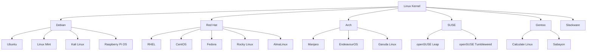

## 🐧 El Universo de las Distribuciones Linux

Linux no es un sistema operativo único, sino un **kernel** sobre el cual se construyen cientos de distribuciones diferentes. Cada distribución (o "distro") combina el kernel Linux con diferentes herramientas, gestores de paquetes, entornos de escritorio y filosofías de diseño.

> 💡 **Dato curioso:** Existen más de 600 distribuciones Linux activas, pero aproximadamente 20-30 representan el 90% del uso mundial.

En este post exploraremos las principales familias de distribuciones, sus características, casos de uso y cómo elegir la correcta según tus necesidades.

---

## 🌳 Árbol Genealógico: Las Grandes Familias

### 📊 Familias Principales por Popularidad



---

## 🔵 Familia Debian: Estabilidad y Confiabilidad

### Debian GNU/Linux - La Madre de Todas

**Filosofía:** Software 100% libre, estabilidad extrema, ciclos de liberación largos.

```bash
# Información del sistema
cat /etc/os-release
# PRETTY_NAME="Debian GNU/Linux 12 (bookworm)"
# NAME="Debian GNU/Linux"
# VERSION_ID="12"
# VERSION="12 (bookworm)"
```

**Características principales:**
- **Gestión de paquetes:** APT (Advanced Package Tool)
- **Arquitecturas soportadas:** 10+ (amd64, arm64, i386, etc.)
- **Ciclo de liberación:** ~2 años
- **Ramas:** Stable, Testing, Unstable (Sid)

**Comandos esenciales:**
```bash
# Actualizar sistema
sudo apt update && sudo apt upgrade

# Buscar paquetes
apt search nginx
apt show nginx

# Instalar software
sudo apt install nginx mysql-server php-fpm

# Gestión de repositorios
sudo nano /etc/apt/sources.list

# Información de paquetes instalados
dpkg -l | grep nginx
```

**Casos de uso ideales:**
- ✅ Servidores de producción críticos
- ✅ Entornos que requieren máxima estabilidad
- ✅ Infraestructura empresarial
- ✅ Sistemas embebidos

### Ubuntu - Linux para Humanos

**Versiones principales:**
- **Ubuntu LTS:** Soporte a largo plazo (5 años)
- **Ubuntu Regular:** Liberaciones cada 6 meses
- **Ubuntu Server:** Optimizado para servidores
- **Ubuntu Desktop:** Entorno de escritorio moderno

```bash
# Información de versión Ubuntu
lsb_release -a
# Distributor ID: Ubuntu
# Description:    Ubuntu 22.04.3 LTS
# Release:        22.04
# Codename:       jammy

# Repositorios PPA (Personal Package Archives)
sudo add-apt-repository ppa:ondrej/php
sudo apt update

# Snap packages (paquetes universales)
sudo snap install code --classic
sudo snap install discord
snap list

# Gestión de servicios con systemd
sudo systemctl status nginx
sudo systemctl enable nginx
sudo systemctl start nginx
```

**Variantes oficiales:**
- **Kubuntu:** KDE Plasma
- **Xubuntu:** XFCE (ligero)
- **Lubuntu:** LXQt (ultraligero)
- **Ubuntu MATE:** MATE Desktop
- **Ubuntu Budgie:** Budgie Desktop

**Configuración post-instalación Ubuntu:**
```bash
#!/bin/bash
# Script de configuración post-instalación Ubuntu

echo "🚀 Configurando Ubuntu para desarrollo..."

# Actualizar sistema
sudo apt update && sudo apt upgrade -y

# Instalar herramientas esenciales
sudo apt install -y \
    curl wget git vim htop tree \
    build-essential software-properties-common \
    apt-transport-https ca-certificates gnupg lsb-release

# Instalar media codecs
sudo apt install -y ubuntu-restricted-extras

# Configurar Git
read -p "Ingresa tu nombre para Git: " git_name
read -p "Ingresa tu email para Git: " git_email
git config --global user.name "$git_name"
git config --global user.email "$git_email"

# Instalar Docker
curl -fsSL https://download.docker.com/linux/ubuntu/gpg | sudo gpg --dearmor -o /usr/share/keyrings/docker-archive-keyring.gpg
echo "deb [arch=$(dpkg --print-architecture) signed-by=/usr/share/keyrings/docker-archive-keyring.gpg] https://download.docker.com/linux/ubuntu $(lsb_release -cs) stable" | sudo tee /etc/apt/sources.list.d/docker.list > /dev/null
sudo apt update
sudo apt install -y docker-ce docker-ce-cli containerd.io
sudo usermod -aG docker $USER

# Instalar Node.js via NodeSource
curl -fsSL https://deb.nodesource.com/setup_lts.x | sudo -E bash -
sudo apt install -y nodejs

# Instalar VS Code
wget -qO- https://packages.microsoft.com/keys/microsoft.asc | gpg --dearmor > packages.microsoft.gpg
sudo install -o root -g root -m 644 packages.microsoft.gpg /etc/apt/trusted.gpg.d/
sudo sh -c 'echo "deb [arch=amd64,arm64,armhf signed-by=/etc/apt/trusted.gpg.d/packages.microsoft.gpg] https://packages.microsoft.com/repos/code stable main" > /etc/apt/sources.list.d/vscode.list'
sudo apt update
sudo apt install -y code

echo "✅ Configuración completada. Reinicia para aplicar todos los cambios."
```

### Linux Mint - Elegancia y Simplicidad

**Filosofía:** Ubuntu con interfaz más tradicional y codecs multimedia incluidos.

```bash
# Características únicas de Mint
# Cinnamon Desktop Environment
cinnamon --version

# Mint Update Manager
sudo mintupdate

# Gestión de drivers
sudo driver-manager

# Mint Software Manager (interfaz gráfica amigable)
# Timeshift (snapshots automáticos del sistema)
sudo timeshift --create --comments "Pre-upgrade snapshot"
```

### Kali Linux - Penetration Testing

**Especialización:** Seguridad informática y pentesting.

```bash
# Herramientas de pentesting incluidas
kali-tools-top10     # Top 10 herramientas
kali-tools-web       # Herramientas web
kali-tools-wireless  # Herramientas WiFi

# Metasploit Framework
msfconsole

# Nmap avanzado
nmap -sS -sV -O --script vuln target

# Aircrack-ng para WiFi
airmon-ng start wlan0
airodump-ng wlan0mon

# John the Ripper para cracking
john --wordlist=/usr/share/wordlists/rockyou.txt hash.txt

# Configuración de Kali para pentesting
sudo apt update && sudo apt full-upgrade -y
sudo apt install -y kali-linux-large
```

---

## 🔴 Familia Red Hat: Enterprise y Innovación

### Red Hat Enterprise Linux (RHEL)

**Modelo de negocio:** Suscripción empresarial con soporte comercial.

```bash
# Registro del sistema RHEL
sudo subscription-manager register
sudo subscription-manager attach --auto

# Gestión de paquetes con DNF/YUM
sudo dnf update
sudo dnf install nginx
sudo dnf search mysql
sudo dnf info httpd

# Repositorios EPEL (Extra Packages for Enterprise Linux)
sudo dnf install epel-release

# SELinux management
sestatus
sudo setsebool -P httpd_can_network_connect 1
sudo semanage port -a -t http_port_t -p tcp 8080
```

**Herramientas empresariales exclusivas:**
- **Red Hat Satellite:** Gestión centralizada
- **Red Hat Insights:** Analytics y recomendaciones
- **Red Hat Smart Management:** Automatización

### CentOS / Rocky Linux / AlmaLinux

**CentOS Stream:** Rolling release de RHEL
**Rocky Linux:** Sucesor comunitario de CentOS
**AlmaLinux:** Alternativa 1:1 con RHEL

```bash
# Migración de CentOS a Rocky Linux
sudo dnf install -y rocky-release
sudo dnf distro-sync

# Configuración de firewall (firewalld)
sudo firewall-cmd --permanent --add-service=http
sudo firewall-cmd --permanent --add-service=https
sudo firewall-cmd --reload

# Gestión de servicios
sudo systemctl enable --now nginx
sudo systemctl status nginx
journalctl -u nginx -f
```

### Fedora - Innovación y Tecnología Cutting-Edge

**Filosofía:** Última tecnología, laboratorio de pruebas para RHEL.

```bash
# Características únicas de Fedora
# DNF package manager
sudo dnf update
sudo dnf autoremove

# Flatpak integrado
flatpak search gimp
flatpak install flathub org.gimp.GIMP

# RPM Fusion (repositorios adicionales)
sudo dnf install https://mirrors.rpmfusion.org/free/fedora/rpmfusion-free-release-$(rpm -E %fedora).noarch.rpm
sudo dnf install https://mirrors.rpmfusion.org/nonfree/fedora/rpmfusion-nonfree-release-$(rpm -E %fedora).noarch.rpm

# Toolbox containers para desarrollo
toolbox create fedora-toolbox-38
toolbox enter fedora-toolbox-38

# Configuración multimedia
sudo dnf groupupdate multimedia --setop="install_weak_deps=False" --exclude=PackageKit-gstreamer-plugin
```

**Fedora Spins (variantes oficiales):**
- **Fedora Workstation:** GNOME
- **Fedora KDE:** KDE Plasma
- **Fedora XFCE:** XFCE
- **Fedora i3:** Tiling window manager

---

## ⚡ Familia Arch: Rolling Release y Minimalismo

### Arch Linux - DIY (Do It Yourself)

**Filosofía:** Simplicidad, minimalismo, control total del usuario.

```bash
# Arch User Repository (AUR)
# Primero instalar un AUR helper
git clone https://aur.archlinux.org/yay.git
cd yay
makepkg -si

# Usar yay para AUR packages
yay -S visual-studio-code-bin
yay -S google-chrome
yay -Syu  # Actualizar sistema y AUR

# Pacman (gestor de paquetes nativo)
sudo pacman -Syu          # Actualizar sistema
sudo pacman -S nginx      # Instalar paquete
sudo pacman -Rs nginx     # Remover paquete y dependencias
sudo pacman -Ss nginx     # Buscar paquete
pacman -Qi nginx          # Información del paquete

# Limpieza del sistema
sudo pacman -Sc           # Limpiar caché
sudo pacman -Rns $(pacman -Qtdq)  # Remover huérfanos
```

**Instalación básica de Arch:**
```bash
# Guía rápida de instalación Arch
# 1. Preparar discos
cfdisk /dev/sda
mkfs.ext4 /dev/sda1
mount /dev/sda1 /mnt

# 2. Instalar sistema base
pacstrap /mnt base linux linux-firmware

# 3. Configurar sistema
genfstab -U /mnt >> /mnt/etc/fstab
arch-chroot /mnt

# 4. Configuración básica
ln -sf /usr/share/zoneinfo/America/Mexico_City /etc/localtime
hwclock --systohc
echo "es_MX.UTF-8 UTF-8" >> /etc/locale.gen
locale-gen
echo "LANG=es_MX.UTF-8" > /etc/locale.conf

# 5. Configurar red y bootloader
pacman -S grub networkmanager
grub-install /dev/sda
grub-mkconfig -o /boot/grub/grub.cfg
systemctl enable NetworkManager
```

### Manjaro - Arch para Todos

**Filosofía:** Arch con configuración amigable y testing adicional.

```bash
# Manjaro-specific tools
# Pamac (GUI package manager)
pamac search nginx
pamac install nginx

# Manjaro Hardware Detection
sudo mhwd -a pci nonfree 0300  # Instalar drivers de GPU

# Manjaro Settings Manager
manjaro-settings-manager

# Timeshift configurado por defecto
sudo timeshift --create

# Branch switching
sudo pacman-mirrors --api --set-branch testing
sudo pacman -Syyu
```

**Manjaro Editions:**
- **XFCE:** Ligero y eficiente
- **KDE:** Moderno y completo
- **GNOME:** Minimalista y elegante
- **Architect:** Instalación personalizada

### EndeavourOS - Arch Simplificado

```bash
# Welcome app de EndeavourOS
eos-welcome

# EndeavourOS specific packages
yay -S endeavouros-theming
yay -S eos-hooks

# Reflector para optimizar mirrors
sudo reflector --country Mexico --age 12 --protocol https --sort rate --save /etc/pacman.d/mirrorlist
```

---

## 🦎 Familia SUSE: Enterprise Alemán

### openSUSE Leap - Estabilidad Empresarial

```bash
# Zypper package manager
sudo zypper refresh
sudo zypper update
sudo zypper install nginx
sudo zypper search mysql

# Patrón de instalación (meta-packages)
sudo zypper install -t pattern lamp_server
sudo zypper install -t pattern devel_web

# YaST (Yet another Setup Tool)
sudo yast2 network
sudo yast2 firewall
sudo yast2 bootloader

# Snapper (snapshots automáticos)
sudo snapper list
sudo snapper create --description "Pre-update snapshot"
sudo snapper rollback 5
```

### openSUSE Tumbleweed - Rolling Release

```bash
# Tumbleweed specific commands
sudo zypper dup  # Distribution upgrade (rolling)

# Verificar integridad del sistema
sudo zypper verify

# Gestión de repositorios
sudo zypper addrepo https://download.opensuse.org/repositories/devel:/languages:/go/openSUSE_Tumbleweed/ go
sudo zypper refresh
```

---

## ⚙️ Distribuciones Especializadas

### Gentoo - Source-Based Distribution

**Filosofía:** Compilación desde código fuente, optimización máxima.

```bash
# Portage package manager
emerge --sync
emerge --update --deep --newuse @world

# USE flags (características del software)
echo "media-video/vlc qt5 -qt4" >> /etc/portage/package.use
emerge vlc

# Compilación optimizada para tu CPU
echo 'CFLAGS="-march=native -O2 -pipe"' >> /etc/portage/make.conf
echo 'MAKEOPTS="-j$(nproc)"' >> /etc/portage/make.conf
```

### Alpine Linux - Seguridad y Minimalismo

**Uso principal:** Contenedores Docker, sistemas embebidos.

```bash
# APK package manager
apk update
apk add nginx
apk search mysql
apk info nginx

# Características únicas
# - musl libc en lugar de glibc
# - BusyBox para utilities básicas
# - OpenRC como init system
# - Tamaño mínimo (~5MB base)
```

### Clear Linux - Optimización Intel

```bash
# Software bundles
sudo swupd bundle-add dev-utils
sudo swupd bundle-add network-basic
sudo swupd bundle-list

# Actualización automática
sudo swupd update
sudo swupd autoupdate --enable
```

---

## 🏢 Distribuciones Empresariales por Sector

### Servidores Web y Cloud

**Recomendaciones por caso de uso:**

```bash
# E-commerce / High Traffic
# Ubuntu Server LTS + Nginx + MySQL/PostgreSQL
sudo apt install nginx mysql-server php-fpm redis-server
sudo systemctl enable nginx mysql php8.1-fpm redis

# Microservicios / Containers
# Alpine Linux base images
# Dockerfile ejemplo:
FROM alpine:latest
RUN apk add --no-cache nginx php php-fpm
COPY . /var/www/html
EXPOSE 80
CMD ["nginx", "-g", "daemon off;"]

# Enterprise Applications
# RHEL/CentOS con soporte comercial
sudo dnf install httpd mariadb-server php
sudo firewall-cmd --permanent --add-service=http --add-service=https
```

### Desarrollo y DevOps

```bash
# Desarrolladores Full-Stack
# Ubuntu/Fedora con herramientas modernas
sudo snap install code --classic
sudo dnf install nodejs npm python3-pip docker

# DevOps Engineers
# Cualquier distro + containers + orchestration
# Kubernetes cluster setup
sudo kubeadm init --pod-network-cidr=10.244.0.0/16
kubectl apply -f https://raw.githubusercontent.com/coreos/flannel/master/Documentation/kube-flannel.yml

# Data Scientists
# Ubuntu/Fedora + Python ecosystem
sudo apt install python3-pip jupyter-notebook
pip3 install pandas numpy matplotlib scikit-learn tensorflow
```

### Seguridad y Pentesting

```bash
# Kali Linux - Penetration Testing
sudo apt install kali-tools-top10
sudo apt install wireshark nmap metasploit-framework

# Parrot Security OS - Alternativa a Kali
sudo apt install parrot-tools-crypto
sudo apt install parrot-tools-forensic

# BlackArch - Basado en Arch para pentesting
sudo pacman -S blackarch-tools
sudo pacman -S blackarch-exploitation
```

---

## 📊 Comparativa Técnica Detallada

### Gestores de Paquetes

| Distro | Gestor | Comando Install | Comando Search | Comando Update |
|--------|--------|----------------|----------------|----------------|
| **Debian/Ubuntu** | APT | `apt install nginx` | `apt search nginx` | `apt update && apt upgrade` |
| **RHEL/CentOS/Fedora** | DNF/YUM | `dnf install nginx` | `dnf search nginx` | `dnf update` |
| **Arch/Manjaro** | Pacman | `pacman -S nginx` | `pacman -Ss nginx` | `pacman -Syu` |
| **openSUSE** | Zypper | `zypper install nginx` | `zypper search nginx` | `zypper update` |
| **Gentoo** | Portage | `emerge nginx` | `emerge --search nginx` | `emerge --update @world` |
| **Alpine** | APK | `apk add nginx` | `apk search nginx` | `apk update && apk upgrade` |

### Ciclos de Liberación

| Tipo | Distros | Ventajas | Desventajas |
|------|---------|----------|-------------|
| **LTS (Long Term Support)** | Ubuntu LTS, RHEL, SLES | Estabilidad, soporte largo | Software desactualizado |
| **Rolling Release** | Arch, Tumbleweed, Gentoo | Software reciente | Mayor riesgo de fallas |
| **Point Release** | Debian, CentOS, Leap | Balance estabilidad/novedad | Ciclos de upgrade complejos |
| **Hybrid** | Fedora, Manjaro | Testing + estabilidad | Complejidad adicional |

### Requisitos de Hardware

| Distro | RAM Mínima | Storage | CPU | Uso Ideal |
|--------|------------|---------|-----|-----------|
| **Alpine** | 128MB | 1GB | Any | Containers, IoT |
| **Debian** | 512MB | 10GB | i386+ | Servidores estables |
| **Ubuntu** | 2GB | 25GB | x64 | Desktop, desarrollo |
| **Fedora** | 2GB | 20GB | x64 | Desktop moderno |
| **Arch** | 512MB | 10GB | x64 | Personalización |
| **RHEL** | 1GB | 20GB | x64 | Enterprise |

---

## 🛠️ Guía de Selección de Distribución

### Para Principiantes

```bash
# 1. Linux Mint (más parecido a Windows)
# 2. Ubuntu LTS (soporte largo, comunidad grande)
# 3. Pop!_OS (gaming y desarrollo)
# 4. Zorin OS (interfaz familiar)

# Script de evaluación básica
#!/bin/bash
echo "¿Cuál es tu experiencia con Linux?"
echo "1) Ninguna (principiante total)"
echo "2) Básica (he usado terminal)"
echo "3) Intermedia (configuro servicios)"
echo "4) Avanzada (compilo kernel)"

read -p "Selecciona (1-4): " experience

case $experience in
    1) echo "Recomendación: Linux Mint o Ubuntu" ;;
    2) echo "Recomendación: Ubuntu o Fedora" ;;
    3) echo "Recomendación: Debian o openSUSE" ;;
    4) echo "Recomendación: Arch o Gentoo" ;;
esac
```

### Para Servidores

```bash
# Criterios de selección:
# - Estabilidad a largo plazo
# - Soporte comercial disponible
# - Ciclo de actualizaciones predecible
# - Documentación empresarial

# Servidores críticos
echo "RHEL/CentOS/Rocky Linux - Máxima estabilidad"
echo "Ubuntu Server LTS - Balance precio/rendimiento"
echo "Debian Stable - Estabilidad sin costo"
echo "SLES - Enterprise con soporte alemán"

# Contenedores
echo "Alpine Linux - Mínimo footprint"
echo "Ubuntu Minimal - Optimizado para cloud"
echo "Red Hat CoreOS - Optimizado para OpenShift"
```

### Para Desarrollo

```bash
# Desarrollo Web
echo "Ubuntu/Pop!_OS - Herramientas modernas"
echo "Fedora - Últimas tecnologías"
echo "Arch/Manjaro - Control total"

# Desarrollo Mobile
echo "Ubuntu - Android Studio oficial"
echo "Fedora - React Native + Flutter"

# Data Science
echo "Ubuntu - Jupyter/Conda ecosystem"
echo "Fedora - Latest Python/R packages"
```

---

## 🚀 Instalación y Configuración Avanzada

### Multi-boot Setup

```bash
# Preparar sistema multi-boot
# 1. Crear particiones
sudo cfdisk /dev/sda
# - /dev/sda1: EFI System (512MB)
# - /dev/sda2: Windows (100GB)
# - /dev/sda3: Ubuntu (50GB)
# - /dev/sda4: Fedora (50GB)
# - /dev/sda5: Datos compartidos (resto)

# 2. Instalar Windows primero
# 3. Instalar distribuciones Linux
# 4. Configurar GRUB para detectar todos los sistemas

# Script de configuración GRUB
sudo update-grub  # Debian/Ubuntu
sudo grub2-mkconfig -o /boot/grub2/grub.cfg  # RHEL/Fedora
```

### Containerización para Testing

```bash
# Docker para probar distribuciones
docker run -it ubuntu:22.04 /bin/bash
docker run -it fedora:38 /bin/bash
docker run -it archlinux:latest /bin/bash
docker run -it opensuse/leap:15.4 /bin/bash

# Dockerfile para entorno de desarrollo
FROM ubuntu:22.04
RUN apt update && apt install -y \
    git vim curl wget nodejs npm python3 pip \
    docker.io kubernetes-cli

# LXD/LXC para containers de sistema completo
lxc launch ubuntu:22.04 test-ubuntu
lxc launch images:fedora/38 test-fedora
lxc exec test-ubuntu -- /bin/bash
```

### Automatización con Ansible

```yaml
# playbook.yml - Configuración automática
---
- hosts: all
  become: yes
  tasks:
    - name: Update package cache (Debian/Ubuntu)
      apt:
        update_cache: yes
      when: ansible_os_family == "Debian"
    
    - name: Update package cache (RedHat/Fedora)
      dnf:
        update_cache: yes
      when: ansible_os_family == "RedHat"
    
    - name: Install common packages
      package:
        name:
          - git
          - vim
          - htop
          - curl
          - wget
        state: present
    
    - name: Configure firewall
      firewalld:
        service: ssh
        permanent: yes
        state: enabled
      when: ansible_os_family == "RedHat"
```

---

## 📈 Tendencias y Futuro de las Distribuciones

### Tecnologías Emergentes

```bash
# Immutable Operating Systems
# Fedora Silverblue, openSUSE MicroOS
rpm-ostree install htop
rpm-ostree rollback

# Container-Native Distributions
# Flatcar Container Linux, Red Hat CoreOS
systemctl start docker
systemctl enable docker

# Micro-distributions para Edge Computing
# Alpine Linux, Clear Linux, Ubuntu Core
snap install my-iot-app

# Universal Package Formats
# Flatpak
flatpak install flathub org.gimp.GIMP

# Snap
snap install code --classic

# AppImage
chmod +x MyApp.AppImage
./MyApp.AppImage
```

### Distribuciones Emergentes

```bash
# NixOS - Declarative system configuration
# /etc/nixos/configuration.nix
environment.systemPackages = with pkgs; [
  vim
  git
  firefox
];

# Void Linux - Independent, rolling release
xbps-install -S nginx
xbps-query -s nginx

# MX Linux - Based on Debian Stable
mx-tools
mx-snapshot

# Elementary OS - macOS-like experience
sudo apt install elementary-tweaks
```

---

## 🔧 Troubleshooting Común por Distribución

### Ubuntu/Debian Issues

```bash
# Dependency hell
sudo apt --fix-broken install
sudo dpkg --configure -a

# Repository issues
sudo apt clean
sudo apt autoclean
sudo apt autoremove

# PPA problems
sudo add-apt-repository --remove ppa:problematic/ppa
sudo apt update

# Boot issues
sudo update-grub
sudo grub-install /dev/sda
```

### Fedora/RHEL Issues

```bash
# DNF lock issues
sudo rm /var/lib/dnf/locks/*
sudo dnf clean all

# SELinux problems
sudo setsebool -P httpd_can_network_connect 1
sudo semanage fcontext -a -t httpd_exec_t "/path/to/script"
sudo restorecon -v /path/to/script

# Firewall issues
sudo firewall-cmd --list-all
sudo firewall-cmd --permanent --add-port=8080/tcp
sudo firewall-cmd --reload
```

### Arch Linux Issues

```bash
# Partial upgrade problems
sudo pacman -Syu  # NEVER do partial upgrades

# AUR build failures
cd ~/.cache/yay/package-name
makepkg -si

# Keyring issues
sudo pacman -S archlinux-keyring
sudo pacman-key --refresh-keys

# Boot issues after update
# Boot from Live USB and chroot
mount /dev/sda1 /mnt
arch-chroot /mnt
mkinitcpio -p linux
```

---

## 📚 Recursos de Aprendizaje y Comunidad

### Documentación Oficial

```bash
# Ubuntu
https://help.ubuntu.com/
https://ubuntu.com/server/docs

# Fedora
https://docs.fedoraproject.org/
https://fedoramagazine.org/

# Arch Linux
https://wiki.archlinux.org/  # LA MEJOR wiki de Linux
https://aur.archlinux.org/

# Debian
https://www.debian.org/doc/
https://wiki.debian.org/

# openSUSE
https://doc.opensuse.org/
https://en.opensuse.org/Portal:Documentation
```

### Comunidades y Foros

```bash
# Reddit Communities
r/linux
r/Ubuntu
r/Fedora
r/archlinux
r/linuxquestions

# Telegram Groups
@ubuntu_es
@fedora_es
@archlinux_es
@linux_es

# IRC Channels (Libera.Chat)
#ubuntu
#fedora
#archlinux
#debian

# Stack Overflow Tags
[linux] [ubuntu] [fedora] [arch-linux]
```

### Herramientas de Learning

```bash
# DistroTest - Probar distros online
https://distrotest.net/

# VirtualBox para testing local
sudo apt install virtualbox
sudo dnf install VirtualBox

# QEMU/KVM para virtualización avanzada
sudo apt install qemu-kvm virt-manager
sudo systemctl enable libvirtd

# Vagrant para entornos reproducibles
vagrant init ubuntu/jammy64
vagrant up
vagrant ssh
```

---

## 🎯 Conclusiones y Recomendaciones

### Matriz de Decisión

| Criterio | Ubuntu | Fedora | Arch | Debian | RHEL |
|----------|--------|--------|------|--------|------|
| **Facilidad principiante** | 9/10 | 7/10 | 3/10 | 6/10 | 5/10 |
| **Estabilidad servidor** | 8/10 | 6/10 | 7/10 | 10/10 | 10/10 |
| **Software reciente** | 6/10 | 9/10 | 10/10 | 4/10 | 5/10 |
| **Soporte comercial** | 8/10 | 7/10 | 2/10 | 5/10 | 10/10 |
| **Documentación** | 8/10 | 8/10 | 10/10 | 9/10 | 9/10 |
| **Comunidad** | 10/10 | 8/10 | 9/10 | 8/10 | 7/10 |

### Recomendaciones Finales

**Para empezar con Linux:**
1. **Linux Mint** o **Ubuntu LTS** - Facilidad y estabilidad
2. Práctica en máquina virtual primero
3. Aprende terminal gradualmente
4. Une a comunidades locales

**Para servidores de producción:**
1. **Ubuntu Server LTS** - Equilibrio perfecto
2. **RHEL/Rocky Linux** - Máxima estabilidad empresarial
3. **Debian Stable** - Confiabilidad sin costo

**Para desarrollo:**
1. **Fedora** - Tecnologías más recientes
2. **Pop!_OS** - Optimizado para desarrollo
3. **Arch Linux** - Control total y aprendizaje

**Para especialización:**
1. **Kali Linux** - Pentesting y seguridad
2. **Alpine Linux** - Contenedores y embebidos
3. **Gentoo** - Optimización máxima

### Script Final de Evaluación

```bash
#!/bin/bash
# distro-selector.sh - Selector inteligente de distribución

echo "🐧 SELECTOR DE DISTRIBUCIÓN LINUX"
echo "=================================="

# Nivel de experiencia
echo "1. ¿Cuál es tu nivel de experiencia con Linux?"
echo "a) Principiante total"
echo "b) Básico (he usado antes)"
echo "c) Intermedio (administro sistemas)"
echo "d) Avanzado (contribuyo a proyectos)"
read -p "Respuesta: " exp

# Uso principal
echo -e "\n2. ¿Para qué usarás principalmente Linux?"
echo "a) Desktop personal/trabajo"
echo "b) Servidor web/aplicaciones"
echo "c) Desarrollo de software"
echo "d) Pentesting/seguridad"
echo "e) Aprendizaje/experimentación"
read -p "Respuesta: " uso

# Hardware disponible
echo -e "\n3. ¿Qué hardware tienes disponible?"
echo "a) PC moderna (8GB+ RAM)"
echo "b) PC antigua (4GB- RAM)"
echo "c) Laptop para trabajo"
echo "d) Servidor dedicado"
read -p "Respuesta: " hw

# Procesamiento de respuestas
case "$exp-$uso-$hw" in
    "a-a-"*) echo -e "\n🎯 Recomendación: Linux Mint o Ubuntu LTS" ;;
    "b-a-"*) echo -e "\n🎯 Recomendación: Ubuntu o Pop!_OS" ;;
    "c-b-d") echo -e "\n🎯 Recomendación: Ubuntu Server LTS o Rocky Linux" ;;
    "c-c-"*) echo -e "\n🎯 Recomendación: Fedora o openSUSE Tumbleweed" ;;
    "*-d-"*) echo -e "\n🎯 Recomendación: Kali Linux o Parrot Security" ;;
    "d-e-"*) echo -e "\n🎯 Recomendación: Arch Linux o Gentoo" ;;
    "*-*-b") echo -e "\n🎯 Recomendación: Lubuntu o Xubuntu (ligeras)" ;;
    *) echo -e "\n🎯 Recomendación: Ubuntu LTS (versátil para todo)" ;;
esac

echo -e "\n💡 Consejos adicionales:"
echo "- Prueba primero en máquina virtual"
echo "- Lee la documentación oficial"
echo "- Une a la comunidad de tu distro elegida"
echo "- Haz backup antes de instalar"
```

---
**Andrés Nuñez - t4ifi**
